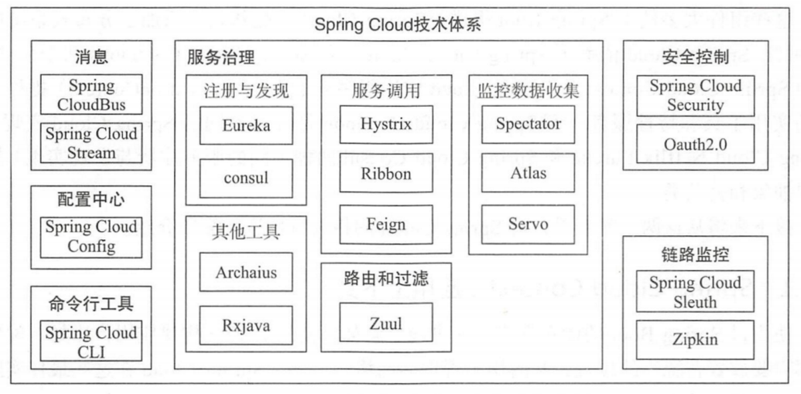

## SpringCloud系列学习
> https://github.com/Advanced-SpringCloud/cloud-book
> 
> 自主文档：SpringCloud
> 链接：http://note.youdao.com/noteshare?id=44bfed43117747d9409c519ad68c7f81

微服务是一种比较复杂，内涵丰富的架构模式，它包含很多支撑“微”服务的具体组件和概念，其中一些常用的组件及其概念如下：
1. [服务注册与发现](#1)
2. [负载均衡](#2)
3. [服务网关](#3)
4. [配置中心](#4)
5. [继承框架](#5)
6. [调用链监控](#6)
7. [支撑平台](#7)

<h2 id="1"> 服务注册与发现 </h2>

服务提供方将己方调用地址注册到服务注册中心，让服务调用方能够方便地找到自己；服务调用方从服务注册中心找到自己需要调用的服务的地址。

<h2 id="2"> 负载均衡 </h2>
服务提供方一般以多实例的形式提供服务，负载均衡功能能够让服务调用方连接到合适的服务节点。并且，服务节点选择的过程对服务调用方来说是透明的。

<h2 id="3"> 服务网关 </h2>
服务网关是服务调用的唯一入口，可以在这个组件中实现用户鉴权、动态路由、灰度发布、A/B测试、负载限流等功能。

<h2 id="4"> 配置中心 </h2>
将本地化的配置信息（Properties，XML，YAML等形式）注册到配置中心，实现程序包在开发、测试、生产环境中的无差别性，方便程序包的迁移。

<h2 id="5"> 集成框架 </h2>
微服务组件都以职责单一的程序包对外提供服务，集成框架以配置的形式将所有微服务组件（特别是管理端组件）集成到统一的界面框架下，让用户能够在统一的界面中使用系统。

<h2 id="6"> 调用链监控： </h2>
记录完成一次请求的先后衔接和调用关系，并将这种串行或并行的调用关系展示出来。在系统出错时，可以方便地找到出错点。

<h2 id="7"> 支撑平台 </h2>
系统微服务化后，各个业务模块经过拆分变得更加细化，系统的部署、运维、监控等都比单体应用架构更加复杂，这就需要将大部分的工作自动化。现在，Docker等工具可以给微服务架构的部署带来较多的便利，例如持续集成、蓝绿发布、健康检查、性能健康等等。如果没有合适的支撑平台或工具，微服务架构就无法发挥它最大的功效

